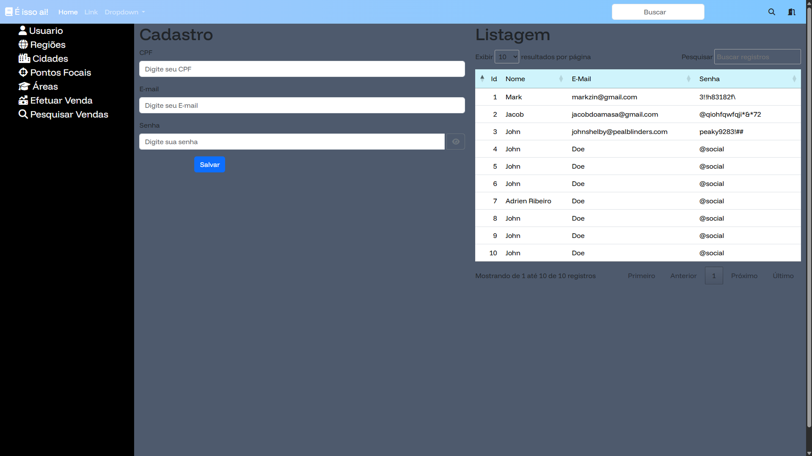

### Recursos de interaçoes comerciais Senac
---

> O R.I.C.S é um sistema comercial para gerenciar venda de cursos, onde é possível ter uma visão detalhada de vendas e afins.
### Ajustes e melhorias

O projeto está em desenvolvimento e as próximas atualizações serão voltadas para os seguintes itens:

- [ ] Reformular o desgin da pagina home
- [ ] Vincular o bando de dados/Interligar as paginas
- [ ] Reformular o design da tela de login
- [ ] Implementar melhorias no codigo
- [ ] Realizar a organização da pasta
